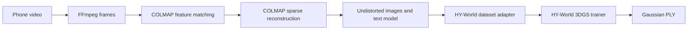

# real2sim-demo

An end-to-end real2sim pipeline, built one inspectable stage at a time.

The current milestone is:

```text
casual video -> extracted frames -> COLMAP cameras/sparse points -> HY-World 3DGS -> PLY
```

Instance segmentation, mesh extraction, collision generation, and MuJoCo are intentionally
outside this milestone.

## Stage 1



Every run writes a manifest, trace, per-command logs, intermediate camera data, held-out
renders, and the final Gaussian PLY path. COLMAP and HY-World remain external tools; this
repository provides orchestration and the required data adapter rather than copying their
implementations. The configured HY-World source revision is also stored in each run manifest
and Gaussian provenance file.

## Reproducibility Contract

The Python package is locked by `uv.lock`. External GPU software is pinned or verified as
follows:

| Component | Reproduced version |
| --- | --- |
| Python | 3.11 (tested with 3.11.15) |
| COLMAP | 4.1.1 CUDA, commit `a0d785f` |
| HY-World 2.0 | commit `7f668e67c74338d50684e57be46a438459b6bbe1` |
| PyTorch | 2.7.1 + CUDA 12.8 |
| FFmpeg | modern build with H.264/HEVC decode support |

Large binaries, model weights, videos, and run outputs are deliberately excluded from Git.
Their locations are supplied through environment variables. The checked-in
`reproducibility/hyworld.snapshot.json` records the official repository, fixed archive URL,
and SHA256 hashes for the trainer, requirements, and custom gsplat entry point. Machine-
readable input hashes and acceptance metrics are stored in
`reproducibility/verified_runs.json`.

For the complete public download, source-verification, execution, and
acceptance procedure, see [the reproduction guide](reproducibility/REPRODUCE.md).

CUDA kernels and COLMAP bundle adjustment are not guaranteed to be bitwise deterministic
across GPUs and drivers. Reproduction means matching the pipeline stages, registered-camera
quality gate, artifact schema, and approximate metrics, not byte-identical PLY files.

## Install

Install the orchestration package and its locked development environment:

```powershell
git clone https://github.com/LimbusSpace/real2sim-demo.git
cd real2sim-demo
uv sync --frozen --group dev
```

Install COLMAP 4.1.1 CUDA from the official
[COLMAP releases](https://github.com/colmap/colmap/releases/tag/4.1.1) and install FFmpeg.
Both may live outside this repository.

### HY-World without git clone

Download this fixed archive with a browser or download manager such as FDM:

```text
https://github.com/Tencent-Hunyuan/HY-World-2.0/archive/7f668e67c74338d50684e57be46a438459b6bbe1.zip
```

Extract it to any disk. A full `git clone` is not required. Create the HY-World environment
using the pinned upstream files in that archive:

```powershell
conda create -n hyworld2 python=3.11.15 -y
conda activate hyworld2
python -m pip install -r D:\tools\HY-World-2.0\requirements.txt
python -m pip install --no-build-isolation -e D:\tools\HY-World-2.0\hyworld2\worldgen\third_party\gsplat_maskgaussian
python -m pip install --no-build-isolation -r D:\tools\HY-World-2.0\requirements_git.txt
```

The upstream project documents CUDA 12.8. Only the 3DGS trainer is used here; panorama,
navigation, and diffusion-model weights are not needed for Stage 1.

## Configure

Set these variables in the PowerShell session used to run the pipeline:

```powershell
$env:REAL2SIM_ASSETS = "D:\real2sim-assets"
$env:REAL2SIM_COLMAP = "D:\tools\colmap-4.1.1\COLMAP.bat"
$env:REAL2SIM_GAUSSIAN_PYTHON = "C:\Users\me\.conda\envs\hyworld2\python.exe"
$env:REAL2SIM_HYWORLD_ROOT = "D:\tools\HY-World-2.0"
$env:REAL2SIM_VIDEO = "D:\captures\tabletop.mp4"
```

`REAL2SIM_HYWORLD_DEPS` is optional. It may point to an existing dependency overlay when
the HY-World packages are not installed directly into `REAL2SIM_GAUSSIAN_PYTHON`.

Verify the downloaded source snapshot and the complete local environment:

```powershell
uv run real2sim-verify-snapshot `
  --manifest reproducibility/hyworld.snapshot.json `
  --root $env:REAL2SIM_HYWORLD_ROOT

./scripts/check_stage1_env.ps1
```

The environment check exits with code 1 for missing tools, source hash mismatches, a missing
asset directory, or a Python environment without CUDA-enabled PyTorch.

## Public Smoke Dataset

The public sample uses the small OpenMVG Sceaux Castle dataset at commit
`fde7f5faba555e3c54700477c304488613346a19`:

```text
https://github.com/openMVG/ImageDataset_SceauxCastle/archive/fde7f5faba555e3c54700477c304488613346a19.zip
```

Place the extracted dataset at:

```text
${REAL2SIM_ASSETS}/datasets/openmvg/ImageDataset_SceauxCastle
```

Create the video input from its 11 ordered JPEG files:

```powershell
$dataset = "$env:REAL2SIM_ASSETS\datasets\openmvg\ImageDataset_SceauxCastle"
ffmpeg -y -framerate 2 -start_number 7100 `
  -i "$dataset\images\100_%04d.JPG" `
  -c:v libx264 -pix_fmt yuv420p "$dataset\sceaux_castle.mp4"
```

Inspect all commands without executing external tools:

```powershell
uv run real2sim --config configs/stage1.sceaux.smoke.toml --dry-run
```

Run the 500-step public smoke reconstruction:

```powershell
uv run real2sim --config configs/stage1.sceaux.smoke.toml
```

The acceptance gate is 11 registered cameras, a `gaussian_trained` manifest, and a PLY at
`gaussian/ply/point_cloud_499.ply`. The verified machine produced 7,498 sparse points and
PSNR 15.208 / SSIM 0.6822 / LPIPS 0.421.

## Run a Phone Video

The portable example reads the input from `REAL2SIM_VIDEO` and stores outputs under
`REAL2SIM_ASSETS`:

```powershell
uv run real2sim --config configs/stage1.windows.example.toml --stage prepare
uv run real2sim --config configs/stage1.windows.example.toml --stage train
```

Preparation and training are separate so the COLMAP registration count can be checked in
`manifest.json` before spending GPU time. For a short phone orbit, exhaustive matching is
available in `configs/stage1.tabletop_v1.toml`.

The verified tabletop run used 64 extracted frames. COLMAP registered 23 frames with 553
sparse points; 5,000 HY-World steps produced 54,768 Gaussians and PSNR 30.986 / SSIM 0.9704
/ LPIPS 0.127 on three held-out registered views. The registered views render clearly, but
that capture does not provide complete 360-degree coverage.

## Artifact Layout

```text
<run_dir>/
  manifest.json
  trace.json
  frames_manifest.json
  frames/
  logs/
  colmap/
    database.db
    sparse/
    undistorted/
    model_txt/
  hyworld_dataset/
    images/
    cameras.json
    points.ply
    provenance.json
  gaussian/
    ckpts/
    ply/
      point_cloud_<step>.ply
    renders/
      val_step<step>_<view>.png
    provenance.json
```

The pipeline selects the COLMAP sparse model with the most registered images instead of
assuming `sparse/0` is the best reconstruction. Failures are recorded in the manifest and
the corresponding command log. A checkpoint without a PLY does not count as success.

## Capture Notes

- Record a slow 30-60 second orbit around a small tabletop scene.
- Keep exposure and focus locked and avoid motion blur.
- Use opaque, textured objects and keep static background features visible.
- Avoid transparent, mirror-like, or textureless objects for the first run.
- Move the camera position; do not only rotate in place.

Monocular COLMAP reconstruction has arbitrary global scale. Metric calibration is deferred
until the physics-asset milestone.

## Development

```powershell
uv sync --frozen --group dev
uv run pytest -q
uv run ruff check .
uv run mypy src
```

GitHub Actions runs the same checks plus a full dry-run on every push and pull request.
